DMC Ambassador Training

# Module 1—Getting on Board

## Overview

The Global Ambassador Program (GAP) is open to individuals who have a desire to learn DMC and its app Foggie, regardless of prior knowledge. A can-do attitude is preferred.

The program includes nine modules, its projects, and corresponding DMC awards associated with projects. The length of the GAP can range from 4 to 24 weeks. You are welcome to expedite your learning path and finish all the projects earlier. Upon project completion, participants are eligible for DMC or Foggie badges. Currently, these awards range from 5 DMC to 720,000 DMC. And the awards are subject to change without advanced notice.

This program is ongoing, allowing participants to join at their convenience. Once enrolled, you will become part of the Global Ambassador Group, which includes numerous experts who are ready to support you in your project endeavors. We encourage you to make the most of this valuable resource, learn from them, and most importantly establish your own DMC community.

We recognize and appreciate the efforts of those who work hard to complete their projects by awarding them badges. The highest level of achievement in the project is marked by a blue ribbon. The GAP program has two levels: GAP class & its project, and Foggie Badge Level as below:

## 1.1 Mission

The mission of DMC is to ensure the permanent storage of essential and valuable human data. DMC is committed to upholding the values of data equality, freedom, and independence.

## 1.2 Values

In our community, we strive for kindness, mutual respect, and support among members, fostering a positive environment that benefits human society.

## 1.3 Objectives

After completing the class modules and projects, you will be able to:

- understand the ins and outs of Datamall Chain well;

- get DMC wallet, download Foggie Desktop, and experience Foggie storage, decentralized data storage by paying DMC token;

- experience Foggie products and services;

- promote DMC and Foggie to your community;

- acquire Foggie users by your referral code;

- receive DMC awards

## 1.4 Expected Behaviors

Behaviors Required by DMC Global Ambassador:

1. Show appreciation to others' help and support;

2. Don't hesitate to ask for help;

3. Support others and show your kindness;

4. Keep a good record of your work. Welcome to the DMC Ambassador Program.

## 1.5 Join us on social media

Please join us on DMC social media as below:

- DMC official website: https://dmctech.io/

- Discord: https://discord.gg/dmcofficial

- Twitter: https://twitter.com/datamallcoin

- Github: https://github.com/datamallchain

- Medium: https://medium.com/@dmcfoundation

- Telegram: https://t.me/DMC_Foundation

- YouTube: https://www.youtube.com/channel/UCl1_3xsaWsupRnqqYsUd3pg

Foggie, which is developed by Fog Works, is the application layer of DMC. Please join Fog Works social media as well:

- Fog Works official website: https://fogworks.io/

- Discord: https://discord.gg/fogworks

- Twitter: https://twitter.com/fogworksinc/

- Facebook: https://www.facebook.com/fogworksinc

- Linkedin: https://www.linkedin.com/company/fog-works/

- YouTube: https://www.youtube.com/@fogworksinc.2753

- Medium: https://medium.com/fog-works-inc

## 1.6 Set up your invitation link on Discord

***Option 1: How to set it up on a PC?***

1. Join DMC official discord
   https://discord.com/invite/dmcofficial

2. Find \#general channel and click on the icon as circled out in the picture
   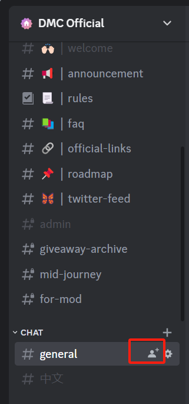

3. Click `Edit invite link`. Please note that https://discord.com/invite/dmcofficial is the official invite link.
   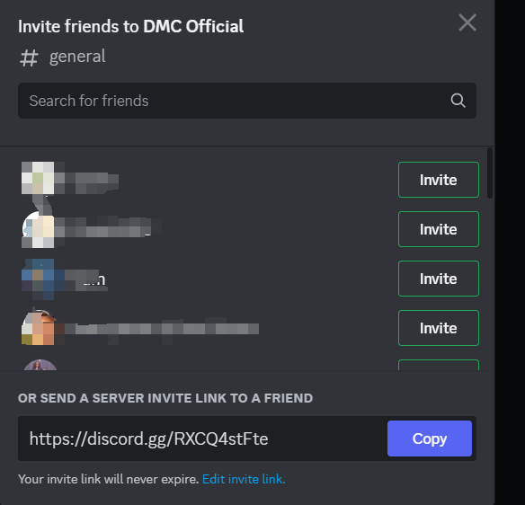

4. Set the invite link expire time as "never" and max number as "no limit", turn on the grant temporary membership, then click on the “generate a new link”
   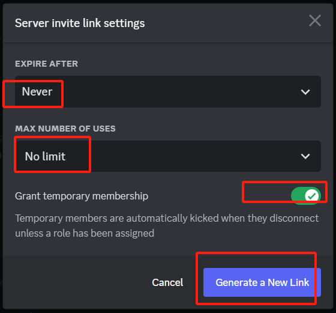

5. You will get your own invite link of DMC discord
   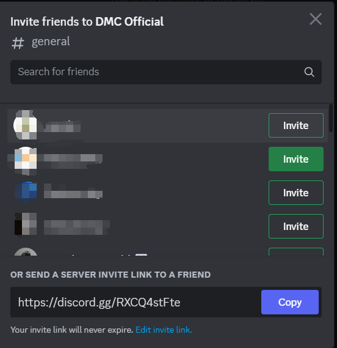

***Option 2: How to set up on cell phone?***

1. Join DMC official discord https://discord.com/invite/dmcofficial

2. Long press the blank space near the \#general channel till a pop-up window appears below as the picture on the right, click on the “invite”
   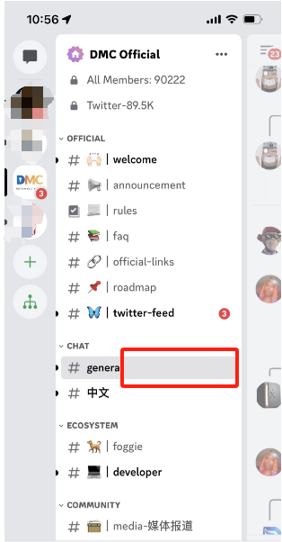!

3. Click on "edit invite link" and set the link never expire and choose the ∞ to set the link use as no limit, turn on the temporary membership and then save the setting
   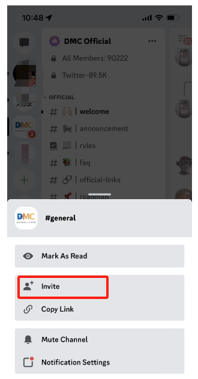!

4. Click the “ copy link” and your link is on your clipboard, you can share the link to your friends
   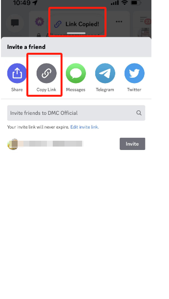

***How to check my invite number and invite list***

If you need your discord invite member list, you can enter ``/invitedlist` with your code in \#invite and rank channel to query the member list that you invited

The XXXXXXXXXX part of your link (https://discord.gg/XXXXXXXXXX) is the code used to check invited members and numbers.

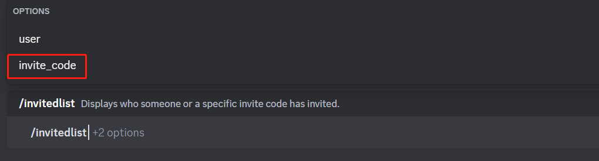

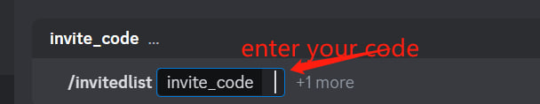

Press enter, you will get your invited member list and invited numbers.

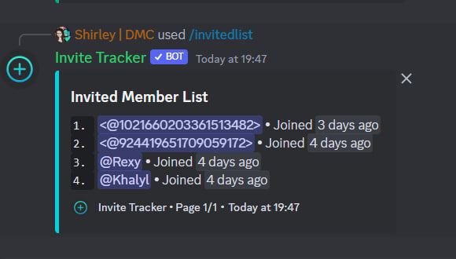

***How to solve the members only showing as numbers?***

Answer: This is a known discord bug that can be fixed by copying and pasting the users from the list into a text channel to show their names. Please ask your invitees to chat and be active on the server, which also helps show their names.

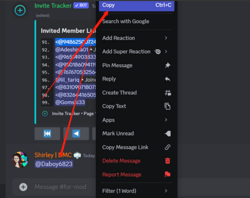

***Why is my invite marked as fake?***

Answer：

1. They are fake

2. The account is less than 3 days old.

Please encourage the invitees to be active in the DMC server.

***How to check my invites if they are silver or not?***

Once you get your invite list, click on the user name, to find out if they are silver or not.

For those users whose usernames appear as a string of numbers, it is because they are not cached in our server，please encourage your member to be active to get a silver member. And there is no download option.

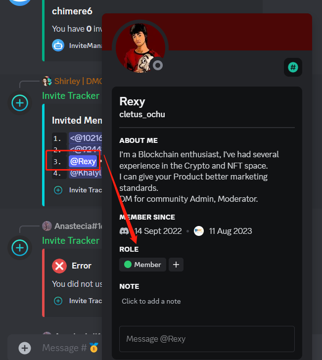

Please note the button under the list will disappear in a bit of time. If you have a long list, you may need to check fast and check several times.

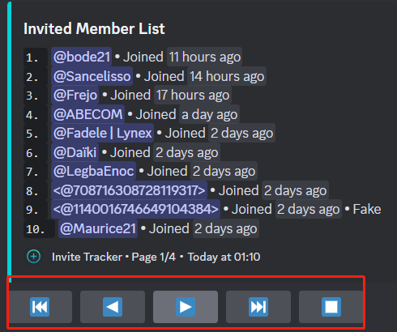

# :medal_sports: Project 1 / Verification Request

1. Follow [*DMC Twitter*](https://twitter.com/datamallcoin) (@datamallcoin) and [*Fog Works Twitter*](https://twitter.com/fogworksinc) (@fogworksinc)

2. Join [*DMC*](https://discord.gg/dmcofficial) and [*Fog Works*](https://discord.gg/fogworks) Discord;

3. Set up DMC Wallet
    1. Follow the steps to download Vofo Wallet: https://medium.com/@dmcfoundation/how-to-create-a-dmc-vofo-wallet-3bcf4ab7dc86
    2. Record your DMC account name
        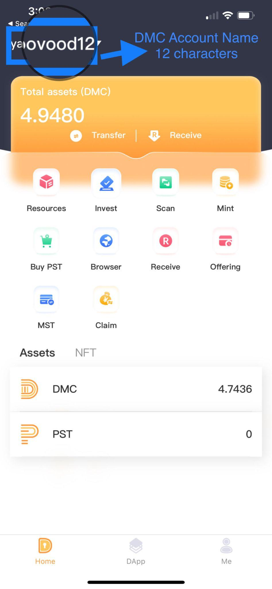

4. Create your DMC Discord Invitation Link (please follow the instruction above)

5. Fill up the form https://forms.gle/tQss7hjxxrSdmLiVA
