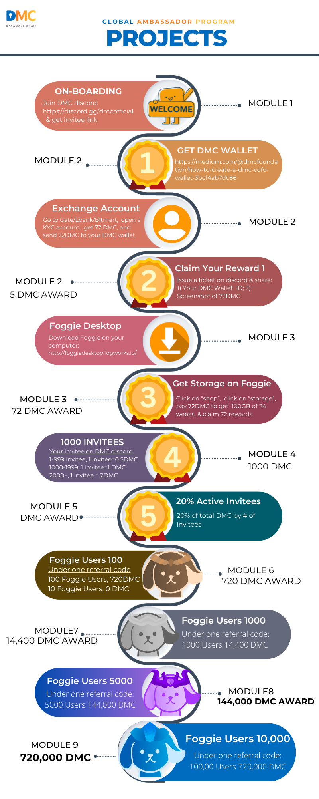

DMC Ambassador Training

# Module 2—What is DMC

## Overview

The Global Ambassador Program (GAP) is open to individuals who have a desire to learn DMC and its app Foggie, regardless of prior knowledge. A can-do attitude is preferred.

The program includes nine modules, its projects, and corresponding DMC awards associated with projects. The length of the GAP can range from 4 to 24 weeks. You are welcome to expedite your learning path and finish all the projects earlier. Upon project completion, participants are eligible for DMC or Foggie badges. Currently, these awards range from 5 DMC to 720,000 DMC. And the awards are subject to change without advanced notice.

This program is ongoing, allowing participants to join at their convenience. Once enrolled, you will become part of the Global Ambassador Group, which includes numerous experts who are ready to support you in your project endeavors. We encourage you to make the most of this valuable resource, learn from them, and most importantly establish your own DMC community.

We recognize and appreciate the efforts of those who work hard to complete their projects by awarding them badges. The highest level of achievement in the project is marked by a blue ribbon.The GAP program has two levels: GAP class & its project, and Foggie Badge Level as below:

## 2.1 Lecture

**Lecture by** Pluto, DMC Global Marketing Director

***What is DMC?***

Datamall Chain is a public storage chain. It is a storage matching trading market. We are committed to creating a usable, cheap, convenient, efficient and secure storage network for WEB3. Anyone can simply participate in the web3 storage ecosystem construction through DMC.

In the DMC network, there are two basic roles. One is a miner, and the miner needs to provide storage space, bandwidth and other infrastructure resources and the corresponding DMC as a storage margin; the other is a user, and the user needs to use DMC to purchase miner storage services. When the transaction is completed and the storage consensus is reached, both users and miners can get DMC rewards at the same time.

Through this measure, DMC implemented the market mechanism through blockchain for the first time. We call it the Nash Consensus. The biggest advantage of this consensus is that under the automatic adjustment of the market mechanism, the storage price will tend to decrease, the storage quality will be better, and the Nash equilibrium will be achieved. The entire storage market will stabilize under the guidance of the Nash Consensus.

In addition, through the DMC mechanism. Users can realize the ownership of data for the first time. And because DMC adheres to the principle of "non-controversial no chain". Resources on the DMC chain will not be wasted. Therefore, DMC leaves sufficient on-chain resources for storage applications.

The dApp can shine brilliantly on DMC. This leads to Foggie, the core of DMC ecology. Personal web3 terminal. On the mobile Internet, everyone should have a smartphone. In web3, everyone should also have a web3 device. Foggie is your wallet, representing you. He can create and save all your web3 digital assets.The ownership of the data is yours, and you can control access to each piece of data. Who you allow to browse, and who you don't allow to browse, and how long. The most important thing is that Foggie will run dApps. Game defi social media NFT. For example, one of the applications that Foggie will support is the NFT casting tool. You can publish your photos, text, music and videos to NFT at any time with one click to share, like, get rewards and sell.

Another feature is AI. You use the confirmed data to train an AI model that only belongs to you. Foggie can do more. Please use your imagination.

***How to get DMC?***

DMC is a utility token that has been listed on Gate.io, LBank and Bitmart.

Firstly, you can go to the exchange platforms to open an account to get DMC.

Secondly, you want to earn DMC by uploading files and storing your data, please download Foggie Desktop on your PC at http://foggiedesktop.fogworks.io/

Thirdly, If you are a miner, you have idle storage and bandwidth resources. You can download DMC mining software to start mining. Relevant software and tutorials are published on this website ( [*http://recruitment.dmctech.io/#/*](http://recruitment.dmctech.io/#/)). The information on the DMC chain can be found here ([*https://www.dmcscan.xyz/*](https://www.dmcscan.xyz/)). A simpler way is to access the mining pool with one click through Foggie to start mining.That's all for today's lecture, thank you for your participation and engagement!

## 2.2 Quiz Section

1. Under which consensus did DMC establish the market mechanism?

   > Answer: nash

2. Can storage users get DMC rewards?

   > Answer: Yes, they can.

3. Under what circumstances will storage users be rewarded?

   >  Answer: Buy storage space

4. What is the core application of DMC ecology?

   > Answer: Foggie

5. What is the biggest feature of Foggie?

   > Answer: Run dApp.

## 2.3 Live Q&A

1. How does the Nash Consensus mechanism contribute to the stabilization of the storage market in the DMC network, and what specific benefits does it bring in terms of storage price, quality, and achieving a Nash equilibrium?

   > Pluto: Good question. Under the Nash consensus, all the characters in the whole system will make choices to maximize their own interests. In order to get more rewards as soon as possible, miners will increase their margin ratio and reduce the storage price. At the same time, in order to ensure that their deposits will not be confiscated, miners improve the safety and reliability of their storage space. If the user buys a space, it must be in his best interest to store real and effective data. Therefore, the whole system will tend to be more and more secure and stable.

2. How does the DMC network ensure a fair distribution of rewards between users and miners based on their contributions?

   > Pluto: The smart contract regulations on the DMC chain specify the income distribution of users and miners.

3. What's the minimum deposit for mining?

   > Pluto:1TB need 40 DMC.

4. How much storage space do I need to mine DMC?

   > Pluto: It's up to you.

5. When a user purchases miner storage services using DMC, what factors determine the transaction's success?

   > Pluto: Smart contracts on the chain provide protection for transactions.Miners need real space. Users need to store real data. Otherwise, the transaction consensus cannot be reached.

6. Do we get to mine for free? I heard there's a fee for that. Please elaborate on that.

   > Pluto: if you have Hard disk, bandwidth, DMC. You can also build your own software, that’s free

7. I read that there is a certain browser that works for mining using Foggie. Can someone use any browser?

   >  Pluto: Download and install the Foggie desktop.

8. You can send a link?

   > Pluto: https://foggiedesktop.fogworks.io/

## 2.4 Twitter Space

**Lecture by** Victor Chen, the Chairman of DMC Foundation

*Twitter Space: Decentralized Storage Service for Creative Industry*

On June 28th, 2023, prominent figures in the Web3 community got together and hosted a Twitter space. The purpose of the Twitter Space is to discuss decentralized storage, especially with the realm of the creative industry and its potential applications for artists and devs alike. Jorge (@techcortes), a self-proclaimed “serial entrepreneur” and Senior Blockchain Professional based in Miami, served as the Space’s host. Speaking in the Space were Victor Chen (@victorweichen), the Chief Operating Office of Fogworks Inc., and Miss Frais (@MissFrais), a prominent crypto artist whose collection sold out in 120 seconds. Touched upon in this discussion was DMC and the DMC token, its function as a utility token, the token’s tokenomics, and how the token opens up a new world of decentralized technology and storage space.

Jorge: Victor would you like to introduce yourself, a little bit about your background and experience, and how you guys got started?

Victor: DMC stands for Datamall Chain, and we created a public chain that is tailored for a marketplace for decentralized storage and the decentralized market, \[especially\] for Web3. We think one hurdle we have to pass \[in regards to Web3\], most of web3 underlines digital assets. Most of the data we store and want to share on Web3 (like NFTs, photos, audio, and movies), most of it is actually shared on Web2, on centralized storage, like AWS and Google Drive. That doesn’t meet the requirements of Web3, completely decentralized and open. What DMC is trying to do is to promote the underlying infrastructure of the decentralized layer of Web3, and the application that is going to be running on Web3. Our team is very seasoned on cloud storage and P2P communication and blockchain technology. Our team, we used to create the largest P2P network in the world, and occupied up to 50% of the P2P traffic globally. We also have very seasoned engineers from cloud service providers. We want to make Web3 a better Web3, and promote the real useful data storage service in the Web3 space.

Jorge: How is the interface with IPFS interacting with artists in creative industries and how can these artists have the best experience with DMC?

Victor: After artists create digital art and want to mint NFTs, these online digital assets need to find a place to be stored. OpenSea is actually using centralized storage, so if you create an NFT on OpenSea, it is stored on their network. After a certain period of time, if OpenSea changes its policy or doesn’t work anymore, the NFT will still exist on the blockchain, but the underlying digital assets will be gone from the internet. That’s the problem. We want to put it someplace where it can be permanent, and avoid censorship. Basically, a real decentralized storage that can last is essential. Additionally, IPFS calls itself decentralized storage, but IPFS is only a protocol for data distribution. When you post data onto the IPFS, it is actually put onto a cache, and while the link is permanent, the storage is not permanent. If you want to make that storage permanent, you need a pinging service, like piñata. And again, that’s become a centralized place. If piñata closes business, then that data will be gone. So how can we find a storage vendor that can match my needs. If the storage vendor fails, I should be able to move my data to another storage vendor. What DMC has done is create a free marketplace, for decentralized storage vendors. Since web3 is open, anyone with spare storage space can post their spare space on the marketplace and \[sell their storage\] for others to store the encrypted data. Your data is secure with safety posits with the DMC token, the data is guaranteed to be there. If the data is gone, you will have your payback with the DMC token that \[is staked\]. The second problem with the decentralized storage protocol is that you want to have ownership of your piece of data, and be able to manage the access control. With IPFS, once a link is created, anyone can access that link. We improved the IPFS protocol by introducing another product called Foggie. Foggie is your personal data management server on web3. You can use Foggie to manage your digital assets. You have the ability to take access control.

Jorge: How was your experience with NFTs, and how do you feel about having more ownership of your digital assets?

MF: I really think that it’s something I want to access for the next collection I’m planning to draw (late summer, early August). My curiosity is how can we use the marketplace — me as a creator, would I be paying fees? How is it possible that the marketplace is free?

Victor: In this marketplace, everyone is encouraged to be a demand, supplier, or both. When you use storage space, you will need to pay with a DMC token. When you participate in this network, you can be both a supplier and a demand for storage space. For other people to store their data on your server, you will get paid with DMC when you share your storage space. DMC will also incentivize both the demand and the supplier with token incentives. We will have both demand and supply miners, the mining incentive is split between the demand and the supplier. Whoever gets the bigger piece demands on the current supply-demand relationships (more demands, suppliers get bigger pieces and vice versa). In order to get storage for free, you can get more incentives by participating in DMC tokens. The consensus for the DMC Chain is that any “real” data exchange on the Web3 will get incentivized (sharing your NFT, storage sharing, other people’s NFT collection). By participating in such activities, you will not only get free storage space, you will also get more tokens. We are also planning on doing data recruitment; whoever has data or underlying digital assets, we will help you to ping it permanently on the DMC network. We are also working with public museums and libraries to permanently backup their data in the Web3 space. We are trying to move interest from Web2 to Web3.

Jorge: questions from the Twitter account, Grace asks: how do decentralized storage solutions address copyright and ownership concerns within the creative industries and what role does it play in creating a more fair and more sustainable digital economy?

Victor: So basically in order to protect copyright, blockchain technology can not do it alone. We have a full stack of solutions. You will have a personalized web server to control your data ownership, and store all the metadata for your digital assets. Everyone needs a personal portal to get into the Web3 space, that is the only way to manage your data ownership, it’s like a smartphone to get into the mobile internet. The website protocol is an improvement on the P2P protocol, such as IPFS or Cyber File System(CYFS). You also need NFTs, and blockchain technology. The NFT is what we call a record that is non-fungible, once it is in there with a timestamp, it shows a record with something that no one can change. And then what you need is a legal framework set up around the NFT to show the rights associated with the data. With the legal framework, you can go to court to sue anyone that infringes your copyrights.

Jorge: What is the purpose of creating a token and how do you want the solve the world on a complicated market. What is tokenomics and how to deal with inflation?

Victor: Our token is a utility token, it is not for speculative purposes. The value of the token is attached to the value of the storage service that you’re going to get. This token is basically to measure service, in order to have a valuation associated with every transaction, and that’s the only way to have an incentive value. In regards to inflation, we create different internal tokens for storage service for PST, each PST is correlated to 1GB of storage stored for 7 days. The price of the PST is related to the DMC token and is determined by the market. The valuation of the PST is a so-called stable coin. The DMC token price is decoupled with the price of storage, the purpose of which is to make sure the cost of the storage you get, which disregards the fluctuation of the price in utility tokens. Tokenomics, we are currently working with all the major exchanges, and you can always follow our Twitter or go to our discord to follow the public announcements, so I don’t want to speculate when we’re going to get listed where. The tokenomics, we call it the Nash Consensus, the purpose of the Nash consensus is just to create a free market. Instead of implementing a lot of free information to prevent people from breaking the system, we instead focused on creating a system that implements the free market, meaning that any reasonable player in this market will do whatever is best to their interest, following their system.

Jorge: how do you see the market growing and how can we reach more audiences or more people to enter their web3, the new internet, where we can protect our personal data and intellectual property? and especially censorship?

Victor: So for our tokenomics, we incentivize suppliers and demands, we’re not going to block Amazon or Microsoft or anyone. Depending on the relationship between supply and demand, people will be incentivized to incorporate their Amazon storage space, you can buy Amazon storage space and provide it to the Web3 community and earn those token incentives. We are just creating an open free market for everyone, and that will work with big or small servers. Small servers may not be as sophisticated as large servers, but they can still join small service vendors and incorporate them together into larger services to meet people’s needs and generate more demands. It is against censorship and ensures your ownership. In Web2, the data belongs to the platform, and if that data is allowed to for example train the AI bots, we are not getting any benefits from that even though it is our data.

# :medal_sports: Project 2

1. Go to Discord, issue a ticket to claim your 5DMC reward for opening DMC wallet;

2. Open an exchange account at gate.io / LBank / Bitmart
