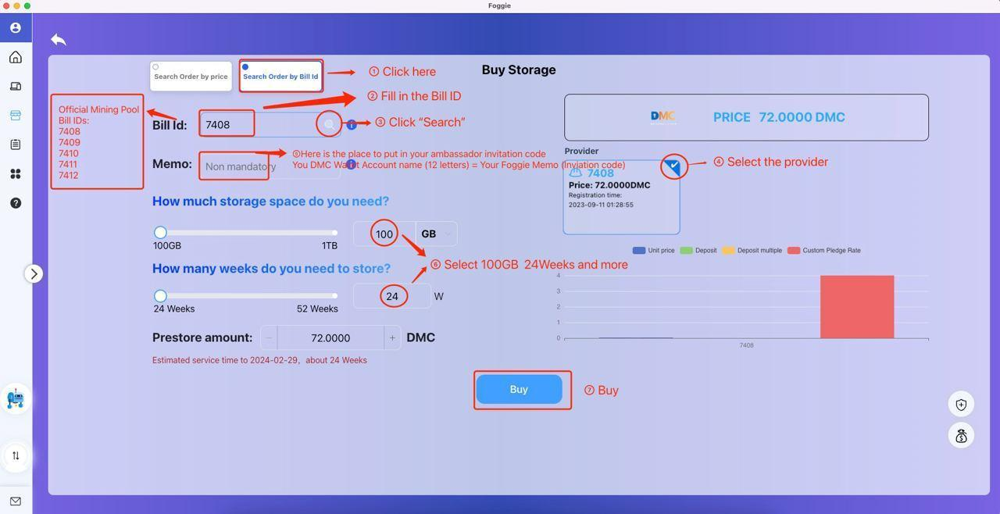

DMC Ambassador Training

# Module 3—Foggie & Foggie Apps

## Overview

The Global Ambassador Program (GAP) is open to individuals who have a desire to learn DMC and its app Foggie, regardless of prior knowledge. A can-do attitude is preferred.

The program includes nine modules, its projects, and corresponding DMC awards associated with projects. The length of the GAP can range from 4 to 24 weeks. You are welcome to expedite your learning path and finish all the projects earlier. Upon project completion, participants are eligible for DMC or Foggie badges. Currently, these awards range from 5 DMC to 720,000 DMC. And the awards are subject to change without advanced notice.

This program is ongoing, allowing participants to join at their convenience. Once enrolled, you will become part of the Global Ambassador Group, which includes numerous experts who are ready to support you in your project endeavors. We encourage you to make the most of this valuable resource, learn from them, and most importantly establish your own DMC community.

We recognize and appreciate the efforts of those who work hard to complete their projects by awarding them badges. The highest level of achievement in the project is marked by a blue ribbon.The GAP program has two levels: GAP class & its project, and Foggie Badge Level as below:

## 3.1 Lecture

**Lecture by** Xinglu Lin, CEO of Fog Works

***Who am I?***

I am Xinglu Lin, Co-Founder, and CEO of Fog Works, Inc. I dropped out of school at the age of 13 and started learning computer programming on my own. At 17, I joined InfoHighWay and worked at ChinaMotion and Hi-Tech Wealth successively. In 2000, Liu Ren and I co-founded DoNews. Later on, I co-founded and acquired many software and Internet companies with Cai Wensheng, including 265.com, where I served as the Co-Founder and CTO. In 2007, we sold 265.com to Google.

What is Fog? Fog computing, also referred to as fog networking or fogging, presents an architectural framework wherein edge devices undertake a significant portion of computation (known as edge computing), storage, and communication. These operations occur locally, with data then being routed through the Internet backbone.

Fog Works has assembled a world-class team with a unique combination of P2P networking, blockchain, and entrepreneurial experience.

***Foggie***

Foggie is the node of a decentralized data storage network. It is the first server for decentralized data storage and is the most cost-efficient solution in the market. It utilizes the Datamall Chain to decentralize data storage permanently. Foggie incentivizes MC tokens to share data and trade idle storage. Foggie has a high-performance hard drive SSD, scalable CPU, and large RAM, making it fast to download and run dApps. Foggie dApps include Foggie Drops, Foggie Genesis NFT, Lite Social, and more.

Foggie has different node versions, Embedded Foggie, Foggie Desktop, Foggie Virtual (V) and Foggie Max. Embedded Foggie is the mining software that is incorporated into a mining machine to help miners to earn DMC tokens. Foggie Desktop is a software that can be downloaded to your personal computer, Foggie Virtual and Foggie Max that provide unique features like DID creation, IPFS pinning service, and user control over data management and protection.

The above Foggie Nodes consist of a decentralized data storage network shown as below. The more nodes are added, the more stable and affordable decentralized data storage network will be.

### Foggie Max

Foggie Max is a consumer device that uses cutting-edge Web3 technology to deliver tangible benefits for everyday consumers and promises to be an essential on-ramp to Web3. Online consumers are overly reliant on Big Tech, leaving them vulnerable to service disruptions, price hikes, changes in terms and conditions, and occasional censorship. Additionally, Big Tech collects massive amounts of data from consumers, resulting in massive data breaches, privacy violations, and billions in oligopolistic profits.

This all starts to change with Foggie Max, the world’s first personal Web3 server. Foggie Max: The World's First Personal Web3 Server

- No Monthly Fees

- Earn DMC rewards while you sleep

- Run privacy-first dApps

- Mint NFTs in bulk with no code

- Avoid censorship & digital piracy

- Escape from Big Tech

### Foggie Virtual

Foggie V (Virtual) is the on-line version of Foggie Max. It was released in January of 2023. It is the world's First Virtual Web3 Server that helps you:

- Earn DMC while you sleep

- Mint NFTs

- Avoid censorship

- Minimize digital piracy

- Run privacy-first dApps

- Maximize your Web3 presence with Foggie.

### Foggie Desktop

Foggie Desktop is software that can be downloaded on one’s computer desktop at http://foggiedesktop.fogworks.io/#/. It is a personal Foggie node, and is for individual decentralized drop-box.

***Foggie Genesis NFT***

We do have our own Foggie Genesis NFT, I will introduce more about our NFT now.

The inspiration for the appearance of the Foggie Genesis NFT puppy is drawn from the three puppies featured in Hans Christian Andersen's fairy tale "The Tinderbox."

In the tale, the characteristics of these puppies are detailed: the first puppy possesses eyes as large as teacups and can acquire copper coins; the second puppy's eyes are as vast as mill wheels, enabling it to collect silver coins; while the third puppy's eyes are as immense as round towers, allowing it to gather gold coins.

The Foggie Genesis NFT puppy serves as a representation of the ideals of aspiration, bravery, and the pursuit of a brighter future. This symbolism is skillfully conveyed through the imagery of the three distinct puppies. Each of these puppies represents a different level of reward and accomplishment, embodying various qualities and capabilities associated with growth and ambition. The incorporation of these distinctive traits not only renders the Foggie NFT puppy captivating but also infuses it with a narrative that holds deep significance. The trio of puppies symbolizes progression, determination, and the quest for excellence, making it appealing to the audience within the NFT community.

Foggie is a virtual Web3 server developed by Fog Works. It belongs to the DMC ecosystem and is built on CYFS OOD. Foggie offers support for various transmission protocols like HTTP, IPFS, and additionally, it's equipped to handle the CYFS protocol. Owners of Foggie servers have the opportunity to participate in the DMC Foundation's Web3-for-DMC rewards program. This initiative enables users to earn DMC rewards by engaging in a range of Web3 activities. These activities encompass actions like publishing content to their Foggie servers.

Foggie distinguishes itself from common pinning services in two main ways. Not only is Foggie a more cost-effective solution, but it also incentivizes users further through mining rewards. This combination of benefits makes Foggie an attractive option for users looking to store data efficiently, serve content within the Web3 ecosystem, manage access to Web3 content, and gain crypto rewards.

Foggie Genesis NFT operates as an equity-based PASS or VIP card. Holders of this NFT enjoy a priority experience with Fog Works' products, comparable to the benefits of owning or renting an actual Foggie server. One of the privileges of holding the Foggie Genesis NFT is access to Fog Drops, an enhanced product that allows NFT issuers to create NFT collections without requiring coding skills. Foggie NFT holders can utilize this service at no cost. Furthermore, Fog Works has plans to introduce an Open Edition version of Foggie, catering to Key Opinion Leaders (KOLs) such as artists, photographers, and designers. This variant is designed to provide additional benefits and tailored experiences. In summary, the Foggie Genesis NFT enhances the user's interaction with Fog Works' offerings. By granting priority access and introducing value-added services, this NFT aims to enrich the holder's experience while delivering heightened value and convenience.

Upon associating the Foggie Genesis NFT with their accounts, users will gain access to enhanced advantages and increased earnings compared to those who do not possess it.

By binding the Foggie Genesis NFT PASS to their accounts, users will accumulate additional privileges and advantages over time. This progressive accumulation of rights and benefits solidifies the Foggie Genesis NFT as a valuable and appreciating asset.

***Fog Drops***

https://fogworks.io/a-preview-of-fog-drops/

Fog Drops is an NFT minting tool and decentralized content marketplace. Foggie Drop creates NFT in bulk with no code and ensures long-term data immutability. Projects-Based on the ERC-721 protocol, the latest version supports the ERC-2981 royalty protocol, and the latest version also supports the OpenSea mandatory royalty Operator Filter Registry. For Personal-Proxy contracts are deployed at only 1/8 of the cost of standard contracts. They also support the Open Edition minting mode.

Here is a sneak preview of Fog Drops, please take a look over here https://fogworks.io/a-preview-of-fog-drops/. No matter if you have a tech background, you can mint NFTs in bulk without needing any code. NFTs will be easily accessible to you; they will be available whenever you want to mint them. You can upload your file to Foggie, which ensures data ownership, and you can also mint your content as an NFT to establish a monetization model for your file. Just that easy!

## 3.2 Quiz

1. Where is Fog of “Fog Works, Inc” coming from?

   > Answer: Fog is coming from “Fog computing”, also referred to as fog networking or fogging.

2. What versions do we have of Foggie so far?

   > Answer: Foggie Desktop, Foggie V and Foggie Max

3. What fairy tale inspired the appearance of the Foggie Genesis NFT puppy and its symbolism?

   > Answer: "The Tinderbox."

4. What protocols does Foggie support for transmission within the Web3 ecosystem?

   1. HTTP
   2. IPFS
   3. CYFS
   4. All above

   > Answer: all of the above

5. What is Fog Drops used for?

   > Answer: Fog Drops serves as an NFT minting tool and decentralized content marketplace for creating NFTs in bulk with no code and ensuring long-term data immutability.

## 3.3 Live Q&A

1. Is Foggie drop like a launch pad? If no, what launch pad does DMC intend using for minting NFTs?

   > Xinglu: Yes, it is. you can think it as a NFT Launchpad • Creator ID permanently associated to any unique file saved to Foggie • NFTs can be minted in bulk with no code and low gas • Files can be merchandised on a fully decentralized marketplace

2. DMC is foggie’s official token right?

   > Xinglu: Foggie is built on Datamall Chian, one of the products produced by Fog Works. We are on the application layer of the DMC ecosystem, implementing the incentive layer of DMC with Datamall Coin.

3. Has the NFTs been minted already?

   > Xinglu: https://nft.fogworks.io/ here it is, please check it out.

# :medal_sports: Project 3: Being a Foggie Node, Get a Storage

1. Download Foggie Desktop

2. Get “Storage” on the “Buy Storage” page. Please be mindful of a couple of things: Firstly, in the Memo section, please put your DMC wallet account name as your invitation code for your community. Secondly, only 5 Bill IDs 7408, 7409, 7410, 7411 and 7412 are the IDs that provide a big discount to you. It is important that you put the information correctly at the beginning. 

3. Claim 72 DMC reward by issuing a ticket on Discord:

   https://discord.com/channels/945157779000295435/1035376241504686140/1035380971161276496
