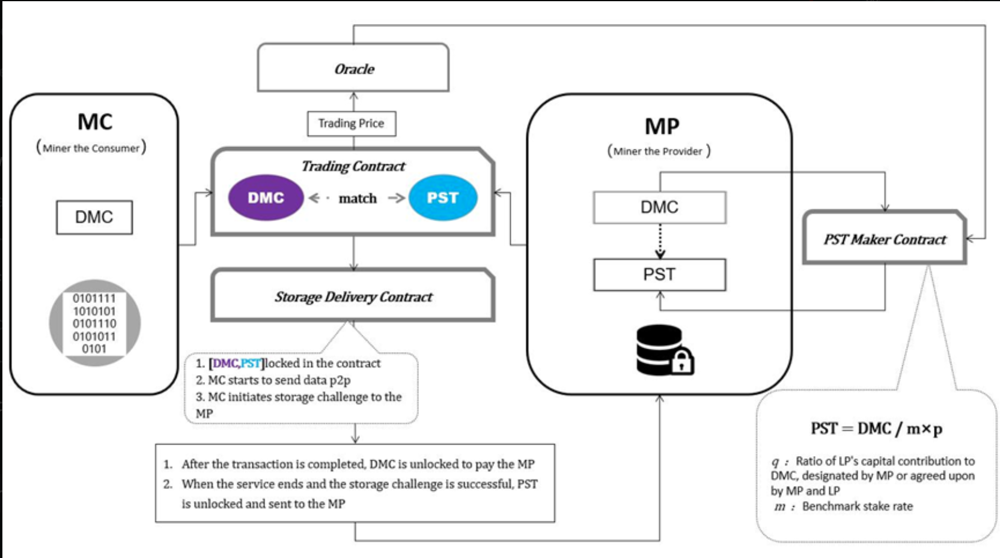

DMC Ambassador Training

# Module 4—DMC Transaction Model

## Overview

The Global Ambassador Program (GAP) is open to individuals who have a desire to learn DMC and its app Foggie, regardless of prior knowledge. A can-do attitude is preferred.

The program includes nine modules, its projects, and corresponding DMC awards associated with projects. The length of the GAP can range from 4 to 24 weeks. You are welcome to expedite your learning path and finish all the projects earlier. Upon project completion, participants are eligible for DMC or Foggie badges. Currently, these awards range from 5 DMC to 720,000 DMC. And the awards are subject to change without advanced notice.

This program is ongoing, allowing participants to join at their convenience. Once enrolled, you will become part of the Global Ambassador Group, which includes numerous experts who are ready to support you in your project endeavors. We encourage you to make the most of this valuable resource, learn from them, and most importantly establish your own DMC community.

We recognize and appreciate the efforts of those who work hard to complete their projects by awarding them badges. The highest level of achievement in the project is marked by a blue ribbon.The GAP program has two levels: GAP class & its project, and Foggie Badge Level as below:

## 4.1 Lecture

**Lecture by** Shirley, DMC operational manager

Hello, everyone! It's a great pleasure to be here in the community and share with all of you. Today, I'll guide you through an exploration of DMC transaction model. After the completion of this community lecture, you will have a better understanding of the DMC storage marketplace.

First, let me explain the three main roles involved in the transaction model of DMC. We use Miner the provider, Miner the consumer, and Limited partner to describe them. Miner the consumer (MC) is the data storage consumer. MC consumes storage capacity by purchasing PST (Proof of Service Token) on the DMC platform. They are the ones who need storage services for their data. Additionally, MC also acts as the verifiers who initiate storage challenges during the transaction of storage services. They play a crucial role in ensuring the integrity and reliability of the storage system.

Miner the provider (MP) is the storage service provider. MP provides storage capacity by selling PST on the DMC platform. They offer their storage resources to MCs in exchange for earning DMC (DMC tokens). MP acts as the server who accepts storage challenges during the transaction of storage services. They are responsible for storing and maintaining the data securely on their servers.

Limited Partners (LPs) in DMC are individuals or entities who provide support to MPs. They put in DMC token to MPs. In return, LPs share in the storage income and rewards generated by the storage transactions. LPs play a supportive role in the DMC ecosystem by contributing to the growth and sustainability of the storage market.

You might have some questions about what PST means. Don't worry, I'll explain this term right now.

PST is the proof of service token. 1PST represents a standard unit of storage service, that is, 1PST corresponds to the storage service capacity of 1G for 7 days. MPs need to stake DMC through the PST Maker Contract to mint PSTs. PSTs cannot be transferred, with 0 decimal places. When trading PST, the system will provide one reference price. The reference price is the median value sorted from all the valid price across the entire network for a non-consecutive 7-day.

The price of DMC may fluctuate, but PST, as a proof of service token, represents unchanging storage capacity. The unit price of PST may fluctuate with changes in DMC. Once you've got a grasp on these technical terms, let's dive into the transaction model of DMC from the perspective of these three roles.First, anyone can become an MC by staking DMC and choosing to mint PST. The system automatically assumes you have real storage capacity. But please don't try to stake DMC and mint PST without having real storage space because there is severe punishment putting in an MCt for it. Engaging in such behavior will result in penalties.That's because MPs need to stake DMC as reserves based on their own storage space. Think of it as a deposit or collateral. The purpose of this is to ensure that the MP's space is genuine. If it's discovered that an MP has provided false space, their staked DMC will be penalized, resulting in significant losses.So, it's crucial for MPs to be truthful about their storage capacity to avoid such harsh consequences.After staking DMC，MP can obtain the right to mint in PST Maker contract. The specific calculation formula is PST = DMC / m’\* p. Let's take a break here.

Let's continue. We just mentioned the specific calculation formula is **PST = dmc / m’\* p**.What does it mean? Suppose the MP’s account has x staked DMC, and at that time, the price of PST is 1 PST = p DMC.The minimum staking rate is m, and the MP can customize the staking rate,which is m'. In this case, the consumer miner can mint a maximum of x/m'\*p PST.

MP can choose the quantity of PST they want to mint based on their actual needs for the purpose of selling.After successfully minting PST, MP can proceed to publish PST orders. MP can set the minimum service period and the deposit amount, which is paid by MC when purchasing the order, the deposit is a multiple of the weekly order price.If MCs default during the service period, the deposit will be deducted and paid to MP, for example, when MCs do not have enough balance to pay expenses. Once the MPs have published their orders, MCs can choose storage space orders that meet their needs. At this point, the transaction contract facilitates the matching and execution of storage demands and services. When purchasing the service, MCs need to pay two fees: the storage service fee and the deposit.

Regarding the storage service fee, consumers miners are required to pay at least the fee for one period (7 days), and the contract will deduct the fee every 7 days to continue the next period of service. MPs can accept DMC from other LPs (DMC Foundation or other participants). MPs can set the maximum percentage that LPs can make, which ranges from 0 to 80%, meaning that MPs need to hold at least a 20% stake within the PST Maker contract.The Delivery Contract is responsible for monitoring the status of data delivery and the distribution of income and rewards.After the order is executed, the storage delivery contract will calculate the corresponding DMC amount based on the quantity of PST traded, MC’s DMC and MP’PST are locked from the MC and MP respectively. During the delivery process, MC can initiate a storage challenge at any time.At the delivery complete time defined by the contract and if all the storage challenges successfully answered, the storage delivery contract will automatically refund the deposit to the MC and return the order reserve to the MP. After the order purchased by the MC expires, they can choose to continue the contract or not. The basic structure of the transaction model can be shown in the picture.

And the reward mechanism and storage challenge will be introduced in next week.That is all for today. Thank you for your participation, it is a great honor to present the lecture with the community. Thank you very much!

## 4.2 Quiz

1. The purpose of staking DMC is:

   1. To become LP.
   2. To mint PST.
   3. To receive rewards.
   4. To become an MC.

   > Answer: To mint. MP needs to stake DMC to mint PST

2. Who can put in MP (Miner the provider)

   1. Miner the consumer
   2. Smart contracts
   3. Limited partner
   4. No one

   > Answer: Limited partner can put in MP.

3. Which contract matches MC and MP?

   1. PST maker contract
   2. Nash consensus
   3. Storage delivery contract
   4. Trading contract

   > Answer: Trading contract matches MC and MP

4. How many roles are involved in the transaction model?

   > Answer: Three: MC MP LP.

5. In the PST Maker contract, how many shares does an MP need to hold at least?

   1. 20%
   2. 40%
   3. 60%
   4. 80%

   >  Answer: 20%

## 4.3 Live Q&A

1. Will LP be rewarded if LP put in the MP? And how many reward is that?

   > Shirley: Yes, LP will be rewarded and the reward is based on the percentage put in.

2. How many PSTs can I buy at most and at least?

   > Shirley: You can buy at least 1 PST and there is no limits for how many you want to buy

3. How to become an LP?

   > Shirley: You can become an LP by putting in tokens

4. How often are MCs required to pay the storage service fee to continue the next period of service?

   > Shirley: MCs are required to pay every 7days to continue the service.

# :medal_sports: Project 4

Please continue to invite your community into DMC discord. The DMC award system for your contribution is as followed::

- For invitee number of 1–999, 1 invitee = 0.5 DMC

- For invitee number of 1,000–1,999, 1 invitee= 1 DMC

- For invitee number of more than 2,000, 1 invitee = 2 DMC

*Requirement 1: host one lecture on Discord, get 50 DMC reward*

As an ambassador, you are required to organize and host at least one lecture per month. Modules 2–9 provide lectures and quizzes that you can utilize at your convenience to design and develop engaging sessions. Your responsibility is to initiate a TEXT AMA (Ask Me Anything) or Quiz session on DMC Discord, encouraging the community to actively participate in the discussion and Q&A. The additional 30 DMC will be rewarded to the lecture.

*Requirement 2: host 2 Twitter Space, get 100 DMC*

We encourage you to host two twitter spaces on your community. You are rewarded with 50 DMC for each Twitter Space. The airdrop of 30 DMC is rewarded to your community.

Please note: The award is subject to change without any advance notice.
