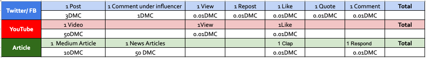

DMC Ambassador Training

# Module 5—What is CYFS Protocol and the underlying technology of DMC?

## Overview

The Global Ambassador Program (GAP) is open to individuals who have a desire to learn DMC and its app Foggie, regardless of prior knowledge. A can-do attitude is preferred.

The program includes nine modules, its projects, and corresponding DMC awards associated with projects. The length of the GAP can range from 4 to 24 weeks. You are welcome to expedite your learning path and finish all the projects earlier. Upon project completion, participants are eligible for DMC or Foggie badges. Currently, these awards range from 5 DMC to 720,000 DMC. And the awards are subject to change without advanced notice.

This program is ongoing, allowing participants to join at their convenience. Once enrolled, you will become part of the Global Ambassador Group, which includes numerous experts who are ready to support you in your project endeavors. We encourage you to make the most of this valuable resource, learn from them, and most importantly establish your own DMC community.

We recognize and appreciate the efforts of those who work hard to complete their projects by awarding them badges. The highest level of achievement in the project is marked by a blue ribbon.The GAP program has two levels: GAP class & its project, and Foggie Badge Level as below:

## 5.1 Lecture

**Lecture by** Zhicong Liu, the Founder of CYFS

Hello everyone, see you again. Today's session has three parts, some of which are technically oriented. Let's start with the first part.

Quick introduction of CYFS, The CYFS protocol is designed with the goal of realizing Web3, or as we prefer to call it, the free internet. We are promoting it to become HTTP v4. In the design of the CYFS protocol, in the future everyone or every organization will have their own servers, which we call OODs, short for OwnerOnlineDevices. With OODs, people can easily own their own data and services, which is also our biggest difference from other protocols right now. In the layered design of the CYFS protocol, we use blockchain technology to realize decentralized DNS, use public-key-based P2P protocols to realize decentralized Certificate Authority mechanisms, and by supporting Content Base protocols, provide decentralized content publishing, storage and transmission at the foundational layer, making this next generation internet composed of OODs reliable, easy to use, and high performance.

Let's delve deeper into the design of CYFS. Let's talking about the first import design of CYFS: “Identity-based" Today's https:// protocol uses a series of centralized facilities to complete trusted communication. There are a series of basic tasks to be done to construct an HTTP link that can be trusted. For example, if you plan to build a link: [*https://www.example.com/abc.mp4*](https://www.abc.om/abc.mp4). you need to buy a domain name from a domain registrar, rent a host and lease a fixed IP from the operator, configure the domain name to point to the host, and buy an https certificate from the CA organization and install it on the host. Any of the above institutions have the right to stop the service without your permission and make your HTTP link invalid. Essentially, this is because the basic protocols that the https protocol relies on are all address-oriented and require additional patch protocols to achieve trusted access. These protocols all depend on the DNS protocol, which was highly centralized when it was designed.

CYFS modifies the HTTP protocol. Similarly, to build a similar link: cyfs://abc/abc.mp4. The process is to use your own blockchain address \$ownerid to buy the name abc from the Name contract. This name will default to link to \$ownerid. Then start a host installed with the CYFS Web Server and connect to the internet. After activating this host with your own private key, the above cyfs link can be accessed (the underlying protocol of cyfs supports P2P). After the entire process is completed, as long as you protect your own private key and maintain the internet connection of your own host, no one can make your cyfs:// link invalid. The underlying design of the CYFS protocol has a new IP protocol that puts identity information at the very bottom `Client.connect_to(server_ip)`. The server and client can only see each other's IP addresses, so all traditional protocols based on TCP/IP are address-based CYFS uses the following method to establish a connection `Client.connect_to(server_public_key)`. The server and client can see each other's public keys and further judge its owner (for example, whether it is owned by the same person). Therefore, CYFS is an identity-based protocol that can become the basic protocol for the entire decentralized internet in the future.That concludes the first part.

Let’s continue to talk about Content-Based next.

The 404 problem has long plagued the current HTTP protocol. The fundamental reason is that the HTTP protocol is location-based. Its design is essentially "pointing to a file on the target host's file system." If the host adjusts its storage structure or the host fails, then the HTTP protocol will fail. Let's take a look at another method of constructing a URL

content_id = hash(abc.mp4)

cyfs://o/abc/content_id.

At this time, we encode the file fingerprint (we usually call it the hash value) pointing to the video when constructing the link into the new URL, giving this URL self-checking ability. The file fingerprint is an important basic technology in cryptography, and its core features are:

- Any two different files will have different fingerprints.

- A file fingerprint corresponds to only one file.

Therefore, the meaning of the above link (`cyfs://o/abc/content_id`) is: point to a file with a file fingerprint of content_id owned by the owner of the name abc. After this file is downloaded through the network, it can be checked against the fingerprint contained in the URL. The link based on Content_id cannot be tampered with. Because the file pointed to by the link cannot be tampered with, it brings a new feature called "location independence".That is to say, the client can download this file from any server, thereby fundamentally solving the 404 problem of the HTTP protocol.When the browser resolves\* cyfs://o/abc/content_id\*, the purpose of abc is to explain the owner of content_id and provide auxiliary positioning: linking the name abc owner's OOD can most likely get the target file.In the future, different browsers can use different methods to find more sources, achieving the decoupling of transmission optimization and link construction.This means that as a content publisher, you can store ordinary content on your own host, and when the content becomes popular, you can deploy the content on more other's hosts through any CDN network (such as DMC) without modifying the URL. Let the owner of the content completely control the accessibility of the content they create. The second part is over. This part discussed a common feature of all Web3 protocols, but CYFS does not rely on slow DHT technology.

OK, let's move to the final part, understanding the use of the above features from the perspective of DMC: decentralized storage network. I will explain how to use CYFS from the delivery process of the DMC storage contract.

- Step 1: Sign a contract User C finds a: suitable storage contract through the DMC network. The provider of the contract is S (miner), and the contract states that the space is provided by device V. The user completes the signing of the storage contract through the operation of DMC's smart contract.

- Step two: user saves data User C sets the encrypted copy D' of data D near the signed contract after encryption. At this point, only users with the private key of C can set the file fingerprint of the stored data.

- Step three: Miner S gets data (storage preparation) Miner S splices the cyfs:// connection based on the above chain information cyfs://o/c_pubkey/content_id_d. Then download the data to be saved based on this link, verify after completion, and call the contract interface to explain that the data has been successfully saved.

- Step four, storage challenge. 
  User C can communicate with miner S's device V for storage challenges. The details of the storage challenge involve the layered construction of storage in DMC, so we will skip it today. CYFS mainly solves the problem here that user C can connect to any device V provided by miner S, allowing everyone who can access the internet to have the opportunity to become a miner.

- Step five, data recovery
  User C's local data is lost and needs to be recovered from miner S. Splice the cyfs link : cyfs://o/s_v_pubkey/content_id. Then download and verify the data based on this link to complete the recovery.

Through the above process, we can see that DMC uses the cyfs protocol to ensure that:

- Everyone can become a miner

- Trusted storage data delivery does not rely on any centralized facilities of today's internet, allowing DMC to become a truly decentralized storage network. Everyone must understand that in any decentralized system, as long as one step is centralized, then it is centralized.

When the second step of user data saving, if the original unencrypted data D is saved, then DMC can immediately become a decentralized content acceleration network.

## 5.2 Quiz

1. What is the most important innovation of the cyfs protocol?

   > Answer: OOD! The most important innovation of `cyfs://` is: we believe that everyone will have their own server (OOD) in the future.

2. Why is it said that the https:// protocol leads to the centralization of the web

   > Answer: Location oriented

3. What is the core difference between the content-based design of cyfs and other content-based protocols? (difficult)

   > Answer: ”CYFS does not rely on slow DHT"

4. Does DMC only support `cyfs://`?

   > Answer: No, it also supports HTTP, IPFS, etc.

5. What is the key problem that DMC solves using `cysf://`?

   > Answer: To ensure that everyone becomes a miner.

## 5.3 Live Q&A

1. Can you explain the challenges associated with the current https protocol's reliance on address-oriented protocols?

   > Zhicong: The biggest problem with the HTTP protocol is that it is controlled by the centralized giant, Google. So for large companies, the current HTTP works very well. They have no incentive to fundamentally improve the design of HTTP. What they don't do, we'll do.

2. The community is free to try, right?

   > Zhicong: Of course~ this is a decentralized community

3. What is the fundamental reason that the HTTP protocol faces the 404 problem?

   > Zhicong: In large companies, any content link is required to use CDN technology when it is generated to avoid 404 issues. I don't think this solution is right, because it's another solution that favors the giants and can't achieve the original goal of equality for everyone on the Internet.

4. What's the required storage space to effectively be a miner in DMC?

   > Zhicong: This is an issue related to DMC economics, which I'm not particularly adept at. However, from what I understand, you can get started with 50GB of space.

5. This is an amazing lecture, I learned a lot. Are we planning to develop the decentralized social media platform in the future?

   > Zhicong: From the information I have received, the DMC ecosystem company FogWorks has already developed some lightweight social products based on DMC.

# :medal_sports: Project 5

Please continue to engage your community on DMC official discord. The requirement is 20% of your invitees being silver members. You are awarded 20% of DMC earned by the total number of invitees (e.g. If you invited 2,500 to discord and 20% of them are active silver members, you can get 2,500 × 2 × 20% = 1,000 DMC). The award is subject to change without any advance notice.

*Requirement*: DMC Ambassadors are expected to contribute a minimum of 10 messages per day on DMC Discord to engage and activate their invitees. The messages should cover various topics, including:

- Reporting your project status and progress on GAP.

- Sharing what you have learned so far.

- Asking questions related to Foggie Desktop, Foggie Storage, and DMC.

- Providing answers to other ambassadors' questions on DMC Discord.

- Expressing appreciation towards others.

- Sharing the file links of your Foggie Storage.

- Sharing content created by you or other ambassadors on the discord.

- Sharing your experience of using Foggie.

- Offering suggestions for improvements regarding Foggie and DMC.

- Sharing memes to lighten the mood.

- Initiating quizzes for fun and engagement.

**Bonus on Content Creation**

Note: Please include "It is a paid post by DMC Foundation" on the bottom of your post. Thanks.
