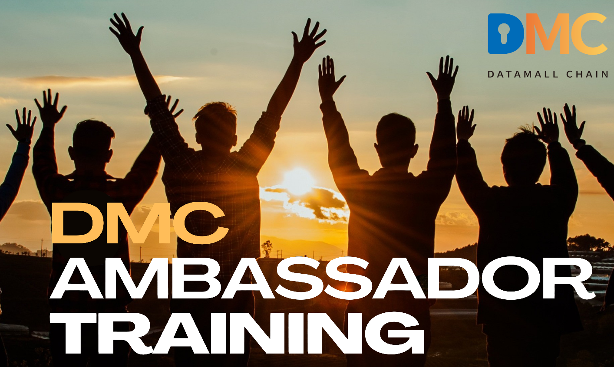

DMC Ambassador Training

# Module 6—Mechanisms & Storage Challenge

## Overview

The Global Ambassador Program (GAP) is open to individuals who have a desire to learn DMC and its app Foggie, regardless of prior knowledge. A can-do attitude is preferred.

The program includes nine modules, its projects, and corresponding DMC awards associated with projects. The length of the GAP can range from 4 to 24 weeks. You are welcome to expedite your learning path and finish all the projects earlier. Upon project completion, participants are eligible for DMC or Foggie badges. Currently, these awards range from 5 DMC to 720,000 DMC. And the awards are subject to change without advanced notice.

This program is ongoing, allowing participants to join at their convenience. Once enrolled, you will become part of the Global Ambassador Group, which includes numerous experts who are ready to support you in your project endeavors. We encourage you to make the most of this valuable resource, learn from them, and most importantly establish your own DMC community.

We recognize and appreciate the efforts of those who work hard to complete their projects by awarding them badges. The highest level of achievement in the project is marked by a blue ribbon.The GAP program has two levels: GAP class & its project, and Foggie Badge Level as below:

## 6.1 Lecture

**Lecture by** Hank

Hello, everyone! It's a great pleasure to be here in the community and share with all of you. Today, I'll guide you through an exploration of DMC's reward mechanism and storage challenge.As we learned in the first community lecture, in the DMC storage marketplace, both Miner the consumer and miner the provider can earn rewards through transactions. And LPs can earn tokens. At the same time, the PoSS consensus mechanism and storage transaction model ensures fair incentives and provide robust security mechanisms to prevent malicious attacks.Therefore, in order to build a decentralized storage trading market that can develop in a healthy manner, we incentivize genuine storage supply and demand transactions.We have introduced a scoring system called Real Storage Incentive (RSI), which serves as the platform's reward currency. It functions similar to a system point with a precision of four decimal places.To be more specific, RSI is designed as a complementary currency to measure community contributions, similar to proof-of-work.The purpose of not rigidly tying community contributions to rewards is to consider the impact of DMC price fluctuations on community incentives and create a more stable reward mechanism. After MC has finished storing the data, the system will reward MC with a certain amount of RSI after the storage challenge verifies that the data has indeed been stored successfully. The reward process is shown in the picture below.

For MPs, after the storage service is successfully completed and storage challenge won, the system will reward MPs with a certain amount of RSI. The reward is distributed to the MPs and LPs according to the proportion of staked DMC. The reward process is shown in below picture.

During the reward distribution phase, both MC and MP enjoy RSI incentives. The total incentive amount is 2 + r RSI for every 1 PST, r is current stake rate, the value of which is at the time of placing the order.MC receive 1 RSI, while MP receive 1 + r RSI. (Tip, r is the current stake rate). The reward distribution occurs every 7 days according to the delivery cycle, which means that MC can claim their rewards every 7 days. If rewards are not claimed, the amount will accumulate. 50% of the weekly incentives will be credited to the account, which MC and MP can claim. The remaining 50% will be distributed weekly after the entire order cycle. For example, if the order cycle is 50 weeks, MPs and MCs can only claim 50% of the incentives per week for the first 50 weeks. After the order is completed, the remaining 50% will be distributed weekly. This means that in the 51st week, the first week's remaining 50% can be claimed, and in the 52nd week, the second week's remaining 50% can be claimed, and so on, until the 100th week when the entire incentive is claimed.Why so? In this way, this helps maintain a balance between DMC and RSI, and ensures that MP and MC will not engage in malicious activities. Provider miners use the DMC to acquire PST minting rights and earn profits. The rewards received by provider miners will be distributed to LPs in proportion to DMC.

Now, let’s move to the second part: storage challenge.

DMC advocates real storage and aspires to build a benign decentralized storage trading market, while real storage requires the verification of blockchain-based smart contracts. After MC reaches a trading contract, they can transmit the storage data point to point at this stage, while concurrently initiating a storage challenge to MP at any time to verify whether they possess the real storage capacity.

Storage Rule Explanation: After the MC places an order and reaches a transaction agreement with the MP, both parties enter the challenge preparation phase. At this stage, both parties need to submit the Merkle tree root to reach a consensus. Once consensus is reached, the MC enters a 7-day delivery cycle.During each delivery cycle, the MC can initiate multiple storage challenges (provided that the previous challenge is completed before initiating the next one, concurrent challenges are not supported). If no challenges are initiated within a delivery period (7 days), it is considered a successful challenge by default. During the delivery service period, the MC can, in principle, cancel the service for the next cycle (subject to a deduction of the deposit), but the MP is not allowed to cancel the service.

The process can be summarized as follows: Enter the delivery phase - both parties upload the Merkle tree root (reaching consensus) - formally enter the storage challenge phase – MC decides whether to initiate a challenge).Once the formal storage challenge phase begins, the MC can choose to initiate a challenge. During a normal challenge, the MC initiates a challenge with verification data, and the MP responds. The challenges can be categorized as follow picture:

Fairness and justice are guaranteed across all the links of the DMC decentralized storage challenge. The protection of property and data makes users feel more at ease, while false transactions are punished, and arbitration purifies the trading environment. A rigorous smart contract of storage challenge is adopted to spur the growth of real storage supply capacity and incentivizes the harmonious development of a healthy ecosystem for DMC and even the whole decentralized storage trading market.

That’s all for today, if you want to know more details about storage challenges, you can refer to DMC yellowpaper:

https://www.dmctech.io/down/DMC%20Technical%20Yellowpaper-v2.0.pdf

Thank you for your participation, it is a great honor to present the lecture with the community, thank you very much!

## 6.2 Quiz

1. What is the consensus of DMC?

    1. PoW

    2. PoS

    3. PoSS

    4. DPoS

    > Answer: PoSS

2. Who can get a reward from a storage transaction?

    1. MP

    2. MC

    3. LP

    4. All of the above

    > Answer: all of the above

3. What serves as the platform's reward currency?

    1. DMC
    2. PST
    3. RSI
    4. USD

    > Answer: RSI

4. Who can initiate a storage challenge?

    1. MP
    2. MC
    3. LP
    4. DMC holder

    > Answer: MC

5. What is the frequency of reward claim for MC?

    1. Every 3 days
    2. Every 5 days
    3. Every 7 days
    4. Every 10 days

    > Answer: 7 days

## 6.3 Live Q&A

1. If I do not need to put in tokens, so I should set the stake rate to 100%, yes?

   > Hank: Correct! The default ratio is 100% if you do nothing.

2. How does the distribution of incentives in the described model help maintain a balance between DMC and RSI, while preventing malicious activities among MP and MC?

   > Hank: There is a fixed amount of RSI that can be exchanged for DMC every day. Therefore, in order to obtain more DMC, some miners will continue to hold RSI and wait for an appropriate time to exchange it. This can keep the DMC of RSI in a relatively stable state. So RSI is designed as an auxiliary token to measure community contribution, which is similar to the proof of work. The reason why community contribution is not rigidly linked to rewards mainly lies in the consideration to resist the impact of DMC price fluctuations on community incentives, so as to form a more stable reward mechanism. For example, in a certain period, DMC price fluctuations may result in a sharp increase in the number of PSTs, and the total amount of community contribution will increase too. If community contribution is rigidly bound to rewards, the distributable DMC for unit community contribution will fall substantially. This will directly harm the enthusiasm of the community. The non-real time distributed RSI is adopted for reward distribution, which will have a positive effect on stabilizing the RSI/DMC exchange price.

3. How does DMC give us better privacy storage for our data?

   > Hank: Use DMC to measure the value of your data, and stake DMC to ensure the security of your data. Also your data is stored in a decentralized network. Through encryption technology, miners cannot see your data.Decentralized storage systems often incorporate strong encryption techniques to protect data. Data is encrypted before being stored, and only the owner possesses the decryption keys. This ensures that even if the data is accessed by unauthorized parties, it remains unreadable and secure.

4. Why does the MP needs to stake DMC first，I think it is more convenient to sell storage directly.

   > Hank: If the storage space is sold directly, then we do not have any constraints on MP, and when the data of MC is lost, we do not have any compensation to MC. That would be something we don't want to happen.

# :medal_sports: Project 6: 100 Foggie Users

Please recruit your community to become Foggie ”Storage” users of 100G for 24 weeks. Your Foggie users need to purchase storage space of 72 DMC under the required Bill IDs. The target is 100 Foggie Users. Please use your Invitation code **\[Your DMC account name = Your Foggie Storage purchase memo (Your ambassador Foggie Storage invitation code) \]** for the recruitment.

The award for 100 users is 720 DMC. You can either claim it or save more in the future claim for a bigger award.

DMC Initiative of 100,000 Foggie users for 100G/24 weeks within 24 weeks is as followed:

| **Storage Pool** | **Sales# in 24 weeks**                                                                 | **DMC Staking** | **Commission Rate** | **DMC Commission** | **Foggie Badge**       |
|------------------|----------------------------------------------------------------------------------------|-----------------|---------------------|--------------------|------------------------|
| Level 5          | 10,000                                                                                  | 720,000         | 100%                | 720,000             |  |
| Level 4          | 5000                                                                                   | 360,000          | 40%                 | 144,000            |  |
| Level 3          | 1000                                                                                   | 72,000          | 20%                 | 14,400             |  |
| Level 2          | 100                                                                                    | 7,200           | 10%                 | 720                |  |
| Level 1          | 10                                                                                     | 720             | 0                   | 0                  |                        |

Notes:

1. You need to claim the number of Foggie Sales with one referral account within 24 weeks.
2. The timeframe for one referral code last for 24 weeks
3. After 24 weeks, the recalculation of sale# will be in place	

The award is subject to change without any advanced notice.
**