DMC Ambassador Training

# Module 8—The Past and Future of Storage

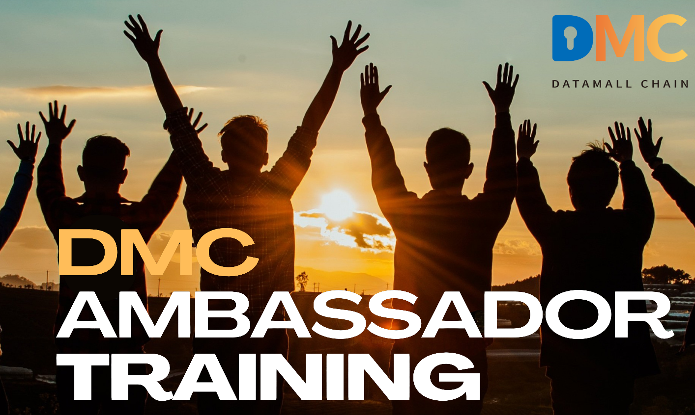

## Overview

The Global Ambassador Program (GAP) is open to individuals who have a desire to learn DMC and its app Foggie, regardless of prior knowledge. A can-do attitude is preferred.

The program includes nine modules, its projects, and corresponding DMC awards associated with projects. The length of the GAP can range from 4 to 24 weeks. You are welcome to expedite your learning path and finish all the projects earlier. Upon project completion, participants are eligible for DMC or Foggie badges. Currently, these awards range from 5 DMC to 720,000 DMC. And the awards are subject to change without advanced notice.

This program is ongoing, allowing participants to join at their convenience. Once enrolled, you will become part of the Global Ambassador Group, which includes numerous experts who are ready to support you in your project endeavors. We encourage you to make the most of this valuable resource, learn from them, and most importantly establish your own DMC community.

We recognize and appreciate the efforts of those who work hard to complete their projects by awarding them badges. The highest level of achievement in the project is marked by a blue ribbon.The GAP program has two levels: GAP class & its project, and Foggie Badge Level as below:

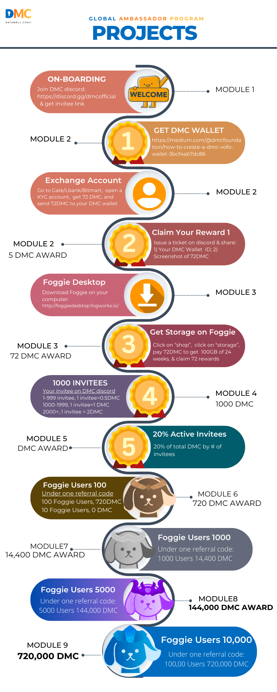

## 8.1 Lecture

**Lecture by** Grace, Global Manager of DMC and Fog Works

Hello, everyone. Great to see you here again. Today, I will provide a concise overview of the history of data storage.

**Punch cards**

Do you guys know what's the earliest storage tool we used? The use of "punch cards," a data storage tool, originated in the 18th century and lasted for two centuries. Punch cards were the first attempt at data storage in a machine language. Punch cards were used to communicate information to equipment "before" computers were developed.

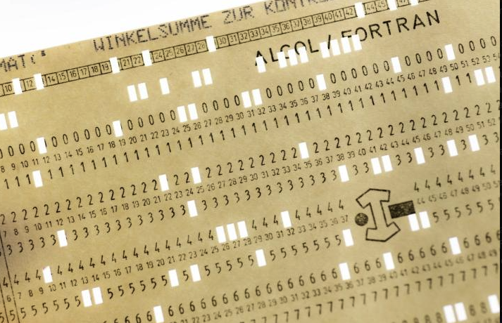

The punched holes originally represented a "sequence of instructions" for pieces of equipment, such as textile looms and player pianos. Eventually, punch cards exited the stage of history due to their inability to integrate well with personal computers, making way for magnetic tapes and disks.

**Magnetic storage**

And then, in the 1960s, “magnetic storage” gradually replaced punch cards as the primary means for data storage.

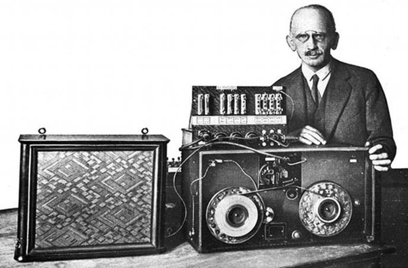

Magnetic tape was first patented in 1928, by Fritz Pfleumer. (Cassette tapes were often used for homemade “personal computers,” in the 1970s and 80s.)

Electronic media such as magnetic tapes and disks allowed information to be stored in binary form on magnetic materials, providing larger storage capacity and faster read/write speeds. Initially used for audio recording and playback, they were later introduced into the field of data storage with the development of computers.

**Optical Discs**

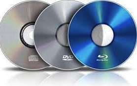

In the 1990s, with the development of optical technology, the optical disk was introduced as a digital storage medium. By using a laser beam to etch tiny pits and bumps on the surface of the disc, these pits and bumps represent binary data of 0s and 1s. During reading, the laser beam is reflected or scattered, and the data is interpreted based on the reflection of light. The emergence of optical discs significantly increased data storage density, allowing digital content to be stored in smaller spaces. However, the storage capacity is relatively low, with the largest capacity of a dual-layer DVD reaching only a few tens of gigabytes. Therefore, optical discs are commonly used for storing audio, video, software, and other data.

**Flash drives**

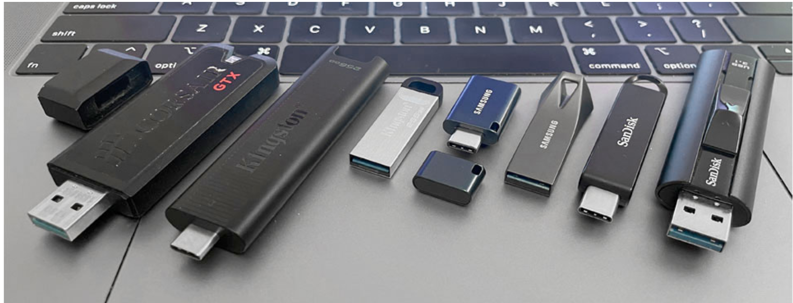

Flash drives appeared on the market, late in the year 2000.

A flash drive plugs into computers with a built-in USB plug, making it a small, easily removable, very portable storage device, but with limited storage space. This represents an early evolution in storage. I hope this brought back some memories for you.

In the second part, I will introduce some modern storage tools.

**Disk storage**

Disk storage is divided into two types: Hard Disk Drives (HDD) and Solid-State Drives (SSD). Hard Disk Drives (HDD) use rotating metal disks and moving read/write heads to store and retrieve data.

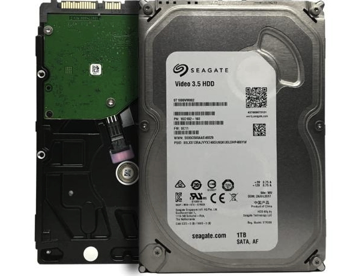

They have relatively slower read/write speeds and are more prone to damage. However, they are not limited by the number of erase/write cycles of flash memory, providing them with a longer lifespan. Additionally, HDDs are more affordable in terms of pricing. On the other hand, Solid-State Drives (SSD) use flash memory chips to store data. They offer faster read/write speeds and are more resistant to vibrations and impacts.

While SSDs have a limited lifespan due to the number of erase/write cycles of flash memory and are generally more expensive, technological advancements have mitigated these concerns to a certain extent. The hard disk drives that emerged in the late 20th century have effectively met the demand for large storage capacity, reaching capacities of several terabytes (TB). Hard disk drives outperform optical discs or tape backup systems by providing much faster data access, and data can be randomly written, modified, deleted, or read. With their increasing storage capacities and high speeds, hard disk drives have become the primary storage medium for personal computers. However, hard disk drives have gained notoriety for their susceptibility to failures and data loss during this process. As a result, users often rely on CDs or DVDs as tools for backing up data from hard disk drives.

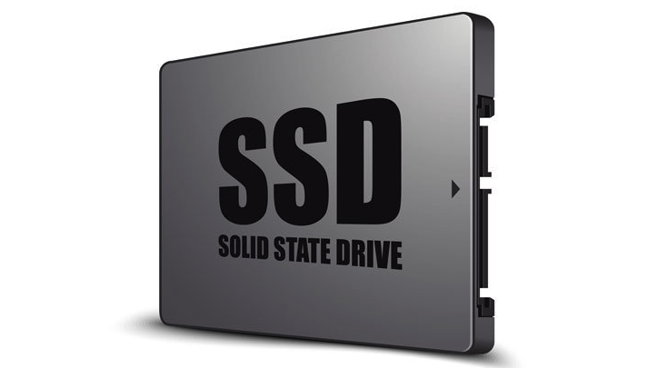

**Cloud Data Storage**

In the 21st century, as we entered the digital age, data storage transitioned to a new stage, marked by the rise of cloud storage, which signifies a significant revolution in information storage and sharing.

Data is no longer confined to local storage but is transmitted and accessed globally through servers connected via the internet, such as Google Drive and Dropbox. Cloud storage offers high scalability, flexibility, and cost-effectiveness. It allows users to purchase storage space on-demand without the need for significant hardware investments. It also provides data redundancy and backup, protecting data from hardware failures and data loss risks. Cloud storage is suitable for individuals, businesses, and organizations, playing a crucial role in data backup, file sharing, collaboration, application hosting, and providing convenient access for mobile devices and remote work. Cloud storage is a typical example of centralized storage, where all data is stored in a single central server or data center. Centralized storage emphasizes convenience and cost-effectiveness but carries the risk of a single point of failure and data privacy concerns.

**Decentralized Data Storage**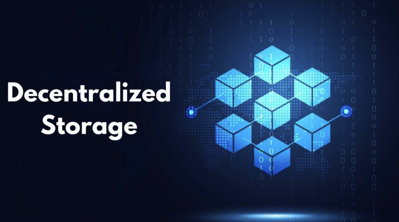

Decentralized storage, on the other hand, stores data through nodes distributed in different locations, placing more emphasis on user control, security, and censorship resistance. However, in some cases, it may face slower data transmission speeds. Distributed Storage Network (DSN) is a significant advancement in the concept of decentralized storage. DSN disperses data storage across various nodes in the network, improving data reliability and availability through data redundancy and sharding techniques.One of the most representative examples is the BitTorrent protocol, which emerged in 2001 and utilizes peer-to-peer (P2P) networks to distribute tasks and work among multiple computers. In recent years, with the rise of blockchain technology, decentralized storage has received further impetus. Blockchain technology provides support for data security, immutability, and consensus mechanisms. Some projects have started using blockchain to build decentralized storage systems, managing data access permissions and incentive mechanisms through smart contracts, thereby enhancing data security and sharing.

One notable project in this area is Datamall Chain.

Datamall Chain is a decentralized storage trading platform that connects data storage demanders with data storage service providers, activating a decentralized data storage trading market. Individuals and businesses with idle storage space can earn DMC tokens by renting out their space, as long as they have at least one device (with a minimum requirement of 8 cores, 16GB of memory, and a 200GB solid-state drive). To meet the demands of storage demanders and ensure the smooth operation of the entire system, Datamall Chain adopts the Proof of Storage Service (PPOS) consensus protocol. Storage providers who fail to meet the requirements will incur economic losses, maintaining platform health through incentive and punishment mechanisms.

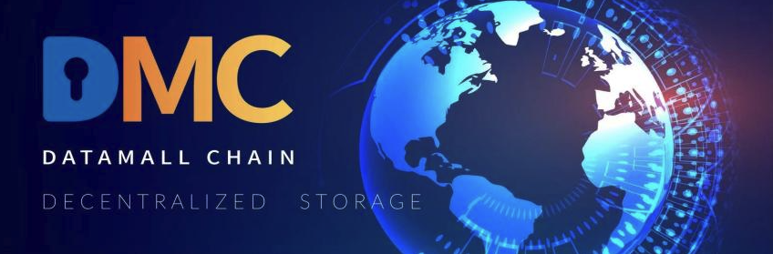

Datamall Chain truly allows users to own their data. At the same time, data is stored in a distributed network, eliminating the risk of a single point of failure in traditional centralized storage. Even if a node fails or is attacked by hackers, other nodes can still provide data access services, improving system stability and availability.

Decentralized storage will continue to evolve and play a greater role in the future. With technological advancements and increased user awareness, people will increasingly recognize the advantages of decentralized storage in data security, privacy protection, data sharing, and drive its widespread application and innovation in various fields. Decentralized storage is expected to become one of the major trends in the field of data storage, providing robust support for data management in the digital age.

**Decentralized Data Storage + AI**

With the continuous development of Artificial Intelligence (AI) represented by ChatGPT, AI can not only assist daily life, but also perform huge automatic operations in data analysis, image recognition, AI-Generated Content, natural language processing, intelligent decision-making and other work. The rapid development of AI technology has become one of the important trends in today’s technology domain, profoundly changing people’s way of life and work.

The development and iteration of AI depends on learning and training from massive data. Through the training process, AI can better understand and predict future trends, thus improving the accuracy of its decision-making. At the same time, AI can continuously optimize its own algorithms and decisions and enhance its autonomy and flexibility. So, data is an important foundation and driving force of AI, and the quality and diversity of data directly affect the effectiveness and performance of AI. The security, cost, and storage capacity of data are important factors that affect the progress of AI.

In addition to large-scale AI learning, the current trend is toward AI personalization, where each user can upload their own information to train AI and allow it to provide personalized services for different individuals. Therefore, personal servers will have stronger computing power in the future. Currently, the mainstream approach is to store data in the cloud storage systems. However, centralized cloud storage systems have some drawbacks, such as data security, data reliability and cost.

**Decentralized storage can improve data security and reliability.** Decentralized storage reduces the risk of single-point failure by storing data on multiple nodes in a distributed manner. The nodes of DMC are distributed in the United States, Singapore, Hong Kong and other countries and regions, thus the risk of single-point is significantly lowered. Decentralized storage adopts redundant storage, which means multiple backups of a single piece of data. Even if one node encounters a problem, the data can still be accessed through other nodes, and data loss can be prevented.

**Decentralized storage can reduce costs.** Traditional centralized storage systems require a large quantity of hardware equipment and carry high maintenance cost. Although many cloud service providers offer different discounts for enterprise needs, but the prices are still high. Decentralized storage, on the other hand, utilizes idle resources of nodes, which is in line with the concept of “sharing” that is gaining popularity around the world this year, and can reduce hardware equipment and maintenance costs. This in turn can reduce the research and application costs of artificial intelligence technology and drive the rapid development of artificial intelligence technology.

Not only that, DMC also provides two ways to further reduce user cost: 1 creating a fair and transparent decentralized storage trading market which enables suppliers to freely set price and demanders to choose to freely , and 2 turning all storage facilities in the decentralized storage market into sources of storage services for DMC and breaking down barriers between different storage projects to bring prices further down. 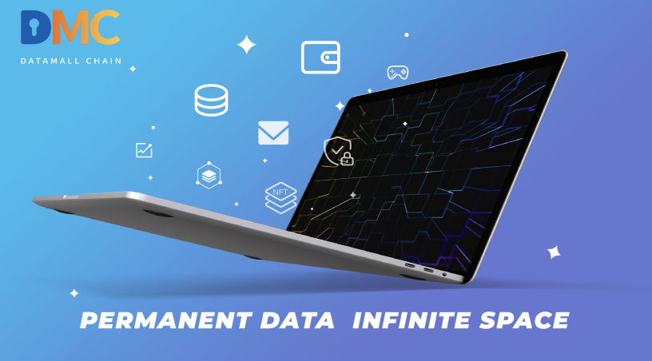

**Decentralized storage can enhance data sharing and accessibility.** During the course of AI development, different organizations and individuals need to share data to achieve better collaboration and innovation. Decentralized storage technology can break down data barriers and make data easier to share and access. This is particularly important for the development of AI, as the quality and quantity of data are important performance factors of AI algorithms performance, and sharing data can improve algorithm performance and accuracy.

In the future, decentralized storage will become more intelligent and automated. Data and resources will be managed more intelligently, and data storage and usage will be optimized in automatic ways. At the same time, decentralized storage will also place greater emphasis on data security and privacy protection and adopt more advanced encryption and privacy protection technologies to ensure data security. With a continuously widening scope of applications, decentralized storage technology will gradually become an indispensable part of AI development.

## 8.2 Quiz

1. In the history of data storage, which technology gradually replaced punch cards as the primary means for data storage in the 1960s?

   1. Optical discs
   2. Flash drives
   3. Magnetic storage
   4. Punch cards

   > Answer: magnetic storage

2. Is cloud Data storage centralized or decentralized?

   > Answer: Centralized, cloud storage is a typical example of centralized storage, where all data is stored in a single central server or data center.

3. Datamall Chain is a decentralized storage trading platform that connects two specific parties to benefit from its services. Who are these two parties?

   > Answer: Data storage demanders with data storage service providers

4. What does the development and iteration of AI depend on?

   > Answer: The development and iteration of AI depends on learning and training from massive data.

5. How can decentralized storage benefit the development of artificial intelligence (AI) technology, as discussed in the text?

   1. Improve data security and reliability.
   2. Reduce costs
   3. Enhance data sharing and accessibility
   4. All above

   > Answer: all the above

## 8.3 Live Q&A

1. What are some common uses for flash drives given their small size and limited storage space?

   > Grace: Despite their limited storage capacity compared to external hard drives or cloud storage, flash drives remain popular due to their portability, durability, and ease of use for various everyday tasks and specific applications. However, the evolution of technology, especially the widespread adoption of cloud storage and decentralized storage, has made data storage and retrieval even more convenient.

2. How can decentralized storage technology help address the data challenges in AI development, and what potential benefits can it offer in terms of improving algorithm performance and accuracy?

   > Grace: As I mentioned above. Decentralized storage can reduce costs. Decentralized storage can improve data security and reliability. Decentralized storage can enhance data sharing and accessibility. Decentralized AI enables personalized models to be built directly on the user's device. This means AI can cater to individual preferences and needs without sending sensitive data to a central server, enhancing both performance and privacy.

# :medal_sports: Project 8: 5,000 Foggie Users

Please recruit your community to become Foggie “Storage” users of 100G for 24 weeks. Your Foggie users need to purchase storage space of 72 DMC under the required IDs. Please check with the DMC team on IDs. The target for project 8 is 5,000 Foggie Users. Please use your referral code for the recruitment.

The award for 5,000 users is 144,400 DMC. You can either claim it or save more in the future claim for a bigger award. 

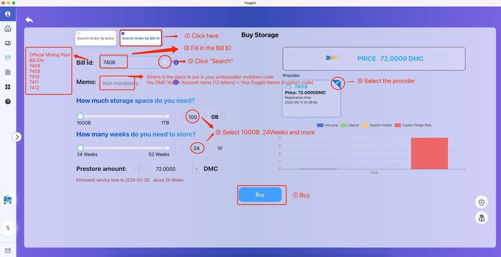

DMC Initiative of 100,000 Foggie users for 100G/24 weeks within 24 weeks is as followed:

| **Storage Pool** | **Sales# in 24 weeks**                                                                 | **DMC Staking** | **Commission Rate** | **DMC Commission** | **Foggie Badge**       |
|------------------|----------------------------------------------------------------------------------------|-----------------|---------------------|--------------------|------------------------|
| Level 5          | 10,000                                                                                  | 720,000         | 100%                | 720,000             |  |
| Level 4          | 5000                                                                                   | 360,000          | 40%                 | 144,000            |  |
| Level 3          | 1000                                                                                   | 72,000          | 20%                 | 14,400             |  |
| Level 2          | 100                                                                                    | 7,200           | 10%                 | 720                |  |
| Level 1          | 10                                                                                     | 720             | 0                   | 0                  |                        |

Notes:

1. You need to claim the number of Foggie Sales with one referral account within 24 weeks.
2. The timeframe for one referral code last for 24 weeks
3. After 24 weeks, the recalculation of sale# will be in place	

The award is subject to change without any advanced notice.
