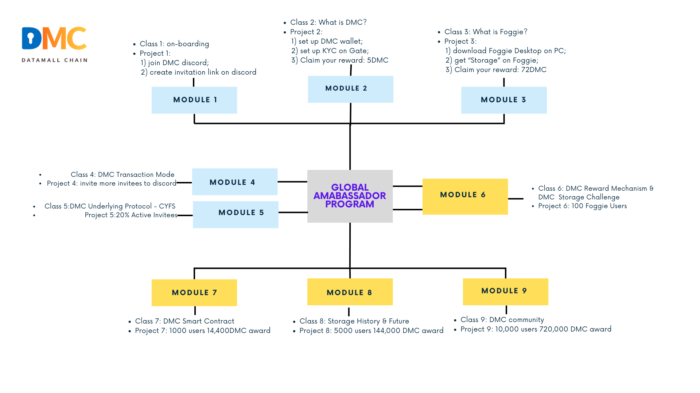
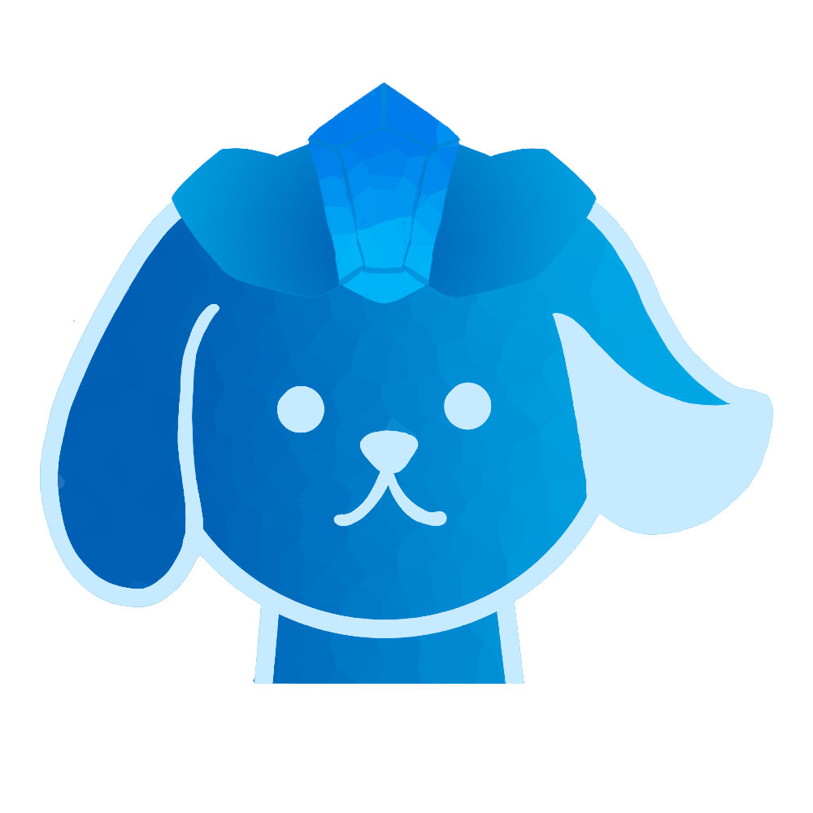
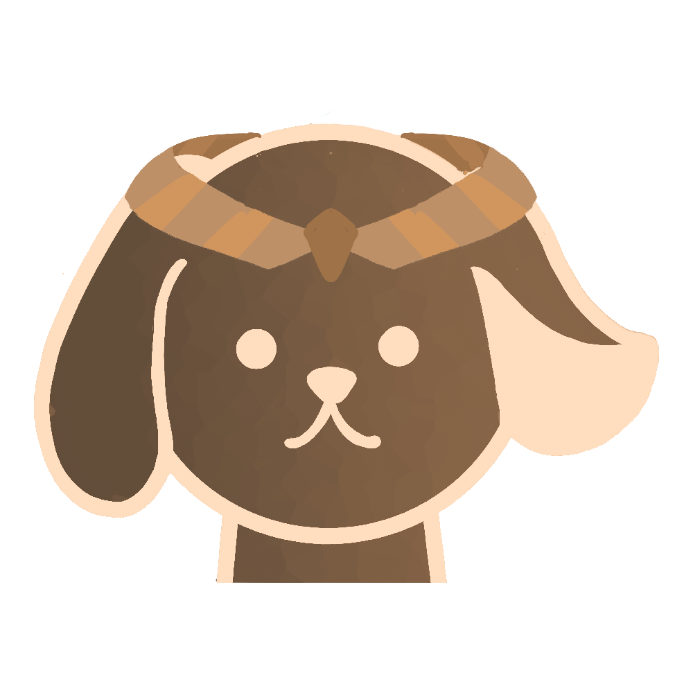

DMC Ambassador Training

# Module 9—Calling for your Contribution to Build DMC Community

## Overview

The Global Ambassador Program (GAP) is open to individuals who have a desire to learn DMC and its app Foggie, regardless of prior knowledge. A can-do attitude is preferred.

The program includes nine modules, its projects, and corresponding DMC awards associated with projects. The length of the GAP can range from 4 to 24 weeks. You are welcome to expedite your learning path and finish all the projects earlier. Upon project completion, participants are eligible for DMC or Foggie badges. Currently, these awards range from 5 DMC to 720,000 DMC. And the awards are subject to change without advanced notice.

This program is ongoing, allowing participants to join at their convenience. Once enrolled, you will become part of the Global Ambassador Group, which includes numerous experts who are ready to support you in your project endeavors. We encourage you to make the most of this valuable resource, learn from them, and most importantly establish your own DMC community.

We recognize and appreciate the efforts of those who work hard to complete their projects by awarding them badges. The highest level of achievement in the project is marked by a blue ribbon.The GAP program has two levels: GAP class & its project, and Foggie Badge Level as below:

## 9.1 Lecture

**Lecture by** Felicia Deng, Director of Global Ambassador Program

Thank you to all the ambassadors for joining us this month. We are truly impressed by your unique talents and initiatives. We feel privileged to witness your growth and are delighted to see your commitment to bringing DMC to your respective countries.

Let me summarize our first Global Ambassador program. The modules are step-by-step for you to learn the whole picture of DMC and its application Foggie.

Throughout this month-long program, you have gained a comprehensive understanding of the Datamall Chain (DMC). After you finish one project, you can start with the next new module. Your hands-on projects will give you a chance to experience DMC products and its apps. After the process, you will build up your team and earn DMC with group effort.

Remember that DMC is more than just a utility token available for purchase on Gate, LBank, and BitMart. It also serves as an easy-to-use decentralized storage platform, similar to Dropbox, Google Drive, or iCloud, where you can securely back up your data, music, movies, and more.It is quite important for everyone to understand that DMC is more than a token. It will serve your storage needs.DMC is an affordable AI-enabled decentralized data storage and transaction platform that connects Miner Consumers (MC) with Miner Providers (MP) in the marketplace, with support from Limited Partners (LP). I would suggest you go to www.dmctech.io to search for the DMC whitepaper to read it through. You will have a better understanding of how amazing DMC is as a storage.

Let's now introduce the five communities within the DMC family: When you read this through, I want you to think about which community you want to get involved first. And let us know which role you want to play. We welcome everyone to DMC family.

1. Storage Application Community: This community includes Fog Works, Done, Xingjie, and others. The Foggy Desktop you are currently using was developed by Fog Works, a Silicon Valley-based company, along with engineering vendors in Asia.It is quite amazing our Ecosystem Partner Done and Xingjie have done excellent jobs!

2. Storage Transaction Community: Here, you can set up a DMC wallet (provided by an Asian vendor), purchase 80 DMC from exchanges like Gate, LBank, or BitMart, download Foggy Desktop to your computer, stake 80 DMC as a Miner Consumer, and buy 100GB of storage space from a Miner Provider for 24 weeks. You can then upload your movies or music into this purchased storage space and earn DMC rewards from the DMC chain.

3. Storage Service Community: DMC is compatible with other web2 or web3 storage providers such as IPFS, StorJ, and AWS. The IPFS pinning service offered by Foggy Desktop is more cost-effective than Pinata. Currently, we provide IPFS pinning service. It is very fast and convenient.We are working on get more service providers on board. Our engineers are working very hard, try to make magic things happen and be available to our communities. I am really grateful for all the efforts they put on.

4. Limited Partner Community: LPs stake for MP. By doing so, LPs receive the most significant rewards for their contributions. Our partners Vofo, Done and Xingjie are LPs. Their teams are strong, and invite community members into their mining pools, and earn more DMC awards.I encourage everyone in our global ambassador program to consider applying for the LP program. This way, you can establish your team as part of the DMC ecosystem, earn a substantial income, and lead a decent life.

5. Developers: Foggie serves as a node on the Datamall Chain. With just a cell phone, you can connect to the mobile internet. By using Foggie devices like Foggie Desktop, Foggie Max, or Foggie V, you can access an AI-enabled decentralized world.

   We are really happy to see that our developer partner in Asia is developing AI-enabled DMC knowledge management tool. In the future, it is very easy to ask questions and get answers in Module 9 immediately through this AI Bot.

   Foggie Max and Foggie V are servers, providing builders and developers with the opportunity to develop Dapps or AI apps. The IPFS pinning service was developed during a Hackathon held in Silicon Valley last year. DMC has over 100 developers worldwide. Additionally, FogDrop is a dApp that allows you to turn your pictures or photos into NFTs and mint them on NFT marketplaces like OpenSea.

Let us continue with Why DMC, the mission of DMC and what are the values behind DMC. The mission of DMC is to ensure the permanent storage of essential and valuable human data. DMC is committed to upholding the values of data equality, freedom, and independence.In our community, we strive for kindness, mutual respect, and support among members, fostering a positive environment that benefits human society.I hope every DMC ambassador can keep our mission and value on mind. There are Stars to guide us through darkness and bear markets. If you are willing, we invite you to play key roles within our community, contributing to the achievement of our mission and values. Together, we can make a meaningful impact in the world of decentralized data storage.If you haven't joined our Global Ambassadors Program yet, I highly recommend applying. While the interview process may be lengthy, it is an enjoyable journey.

Our first global ambassador program select a group of qualified people to attend. And in the future, this program can be self-study, and we encourage individuals without prior experience to apply. The first step is the interview, which will give you a taste of what it's like to be an MC (Miner Consumer) after just six steps.

Upon acceptance, you will receive course materials to learn and projects to complete. Each successfully finished course will earn you awards and recognition. The Global Ambassadors Program not only prepares you to be an MC or MP (Miner Provider) in our community but also enables you to invite more people to join our family and earn rewards for doing so.

Please take a look at the learning path of Global Ambassador Program as above.You can get award along the way.

If you work hard, and can be an LP in the future. Your decent lifestyle can be guaranteed. Once you have completed the Global Ambassadors Program, you can transition into the LP (Limited Partner) program, where you can work in teams and support one another. The more you contribute, the greater your rewards within your team. Remember, the most significant awards are reserved for the teams with outstanding achievements. If you are interested in joining the LP program, please let us know, and we will provide further details.

I know it is quite a lot of information to proceed. Please review them and think it over.

## 9.2 Quiz

1. Which exchange does DMC get listed?

   > Answer: Gate.io

2. Please list at least three family members of DMC communities

   > Answer: Storage Application Community, LP community, developer community

3. Which program you can apply after the Global Ambassador Program

   > Answer: Limited Partner

4. Which products are available now for decentralized data storage?

   > Answer: Foggie

5. What is FogDrop?

   > Answer You can see Foggie has rich products and dApps. Foggie Max is a physical device/server/computer that connecty you to web3 world. Foggie V is on-line version of Foggie Max. FogDrop is dApp running on Foggie V and Foggie Max, which can easily mint NFT, your digital assets. Foggie Desktop intends to be your D- DropBox.
   >
   > If you use them or rent our extra space, you can earn DMC while you sleep.

## 9.3 Live Q&A

1. I think for the safety in the market now, it’s best to pay ambassadors in stable coins to help DMC token. I am afraid some of them will dump, and it is not good for our community. I worked as a business developer for XXX before, and it was one of the plans it helped the project

   > Felicia: Keep in mind, this is also the unique part of \$DMC. \$DMC has been designed to be solely a reflection of the value of decentralized storage — i.e., not an intrinsic value, but a balance between the supply of actual decentralized storage versus the demand for customers wanting decentralized storage.
   >
   > \$DMC is not the equivalent of our company’s valuation, like \$FIL or other tokens. As such, the value of \$DMC should be much more stable than most tokens out there (if you assume that demand and supply of decentralized storage grow together, equally) — be it mainstream tokens or alt tokens.
   >
   > With more people using Foggie (higher demand than the supply), \$DMC will rise. Providing stable tokens to prevent the pumping of DMC is not addressing the fundamental issue. The fundamental solution is to balance the demand and generate more demand. As some of the ambassadors asked us how long the DMC will last in the market? Our answer is as long as decentralized storage exists.

2. Why Foggie storage's price is always changing?

   > Felicia: DMC is offering an open marketplace to attract more people to join the decentralized storage as a provider.
   >
   > Sorely relying on the power of the DMC Foundation to build decentralized storage is not enough. That is the beauty of the Nash Consensus we implemented. MP (Miner provider) wants to provide storage to mine token. MC (miner consumer) wants to get more decentralized storage to back up their data. It's the open market, MP can decide what price they'd like to list on the market.
   >
   > If everything is controlled by a single entity, it will lead to a technological monopoly, and prices will not be too low. Only when the market is open and competitive, decentralized storage prices will become increasingly affordable.

# :medal_sports: Project 9

Please recruit your community to become Foggie “Storage” users of 100G for 24 weeks. Your Foggie users need to purchase storage space of 72 DMC under the required IDs. Please check with the DMC team on IDs. The target for project 9 is 10,000 Foggie Users. Please use your referral code for the recruitment.

The award for 10,000 users is 720,000 DMC. You can either claim it or save more in the future claim for a bigger award.

DMC Initiative of 100,000 Foggie users for 100G/24 weeks within 24 weeks is as followed:

| **Storage Pool** | **Sales# in 24 weeks**                                                                 | **DMC Staking** | **Commission Rate** | **DMC Commission** | **Foggie Badge**       |
|------------------|----------------------------------------------------------------------------------------|-----------------|---------------------|--------------------|------------------------|
| Level 5          | 10,000                                                                                  | 720,000         | 100%                | 720,000             |  |
| Level 4          | 5000                                                                                   | 360,000          | 40%                 | 144,000            |  |
| Level 3          | 1000                                                                                   | 72,000          | 20%                 | 14,400             |  |
| Level 2          | 100                                                                                    | 7,200           | 10%                 | 720                |  |
| Level 1          | 10                                                                                     | 720             | 0                   | 0                  |                        |

Notes:

1. You need to claim the number of Foggie Sales with one referral account within 24 weeks.
2. The timeframe for one referral code last for 24 weeks
3. After 24 weeks, the recalculation of sale# will be in place	

The award is subject to change without any advanced notice.
